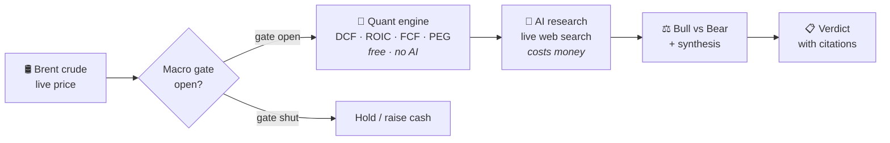

# Argus Stock Agent

**A stock research terminal that checks the weather before it lets you buy.**

[](https://www.python.org/)
[](https://fastapi.tiangolo.com/)
[](LICENSE)
[](#the-frontend)

> ⚠️ **This is not financial advice.** It is a research tool that shows you
> numbers and sources. It does not know your circumstances, it can be wrong, and
> the AI parts can be confidently wrong. Nothing here is a recommendation to buy
> or sell anything. Do your own research, and talk to a licensed professional
> before risking money.

<!--
  SCREENSHOT SLOT — worth filling in. A visitor decides whether to keep reading
  in about five seconds, and one picture of the terminal does more than any
  paragraph here. To add one:
    1. Run the app, take a screenshot of the terminal view.
    2. Save it as docs/screenshot.png
    3. Delete this comment block and uncomment the line below.
  Left commented rather than left broken — a missing-image icon reads worse
  than no image at all.


-->

---

## The problem, in plain words

When you buy a *share*, you buy a small slice of a real company. You're betting
that slice will be worth more later.

So there are really two questions:

1. **Is this a good company?**
2. **Is right now a good time to buy anything at all?**

Almost every stock tool answers question 1 and stops. That's the expensive half
to get wrong, because **question 2 can cancel out question 1 completely.** Buying
a genuinely excellent company at the wrong moment still loses money.

### So how do you answer question 2?

You look at the weather. And in the stock market, one of the loudest weather
signals is **the price of oil.**

Here's why, and it's simpler than it sounds. Oil isn't just fuel for cars. It is
in *almost everything*:

- the plastic in a phone case
- the ship, plane and lorry that carried it to you
- the fertiliser that grew the food in the shop
- a big share of the electricity running the factory

So when oil gets expensive, **it costs more to make and move almost everything.**
Company profits shrink — not just for oil companies, but nearly everywhere at
once. Share prices usually follow those profits down. When oil gets cheap, the
same thing happens in reverse: costs fall, profits get easier, and money tends to
flow into growth stocks like tech.

**Argus checks the weather first.** It reads the live price of Brent crude oil,
sorts it into one of five zones, and treats that as a *gate*. Only when the gate
says conditions are good does it move on to studying individual companies.

You wouldn't plan a picnic without checking the forecast. This checks the
forecast before it lets you buy.

### The gate

| Brent price | Signal | What it means |
|---|---|---|
| under $65 | 🟢 **AGGRESSIVE BUY** | Cheap energy. Deploy cash. |
| $65 – $72 | 🟡 **ADD** | Good conditions. Add to what you own. |
| $72 – $80 | ⚪ **HOLD** | Unclear. Hold, don't start anything new. |
| $80 – $88 | 🟠 **CAUTION** | Costs rising. Trim positions. |
| above $88 | 🔴 **DEFENSIVE** | Bad weather. Raise cash, no new buys. |

**An honest note:** this gate is an *opinion*, not a law of physics. Oil is one
real signal among many, and it will sometimes be exactly the wrong thing to watch.
The point of Argus isn't that this particular rule is correct — it's that the rule
is **written down, applied consistently, and checked before every decision**,
instead of being re-invented from whatever the headlines say that morning. Every
threshold lives in [`config.py`](config.py) and is yours to change.

---

## Try it in 60 seconds

No account, no API key, no cost. Argus deliberately exposes its quant engine
unauthenticated so you can see it work before trusting it:

```bash
git clone https://github.com/DevQuantML/Argus_stock_Agent.git
cd Argus_stock_Agent
pip install -r requirements.txt
uvicorn api:app --port 8000 --workers 1
```

Then in another terminal:

```bash
curl http://localhost:8000/api/demo/AAPL
```

You get real, freshly-computed numbers — no AI involved, nothing charged.
Abridged, but this is the actual response shape:

```jsonc
{
  "ticker": "AAPL",
  "mode": "demo",
  "stock": {
    "name": "Apple Inc.",
    "price": 302.25,
    "pe_trailing": 34.66,
    "market_cap": 4411090796544.0,
    "analyst_rating": "buy"
  },
  "quant": {
    "roic": 82.3,                    // return on invested capital, %
    "fcf_yield": 2.24,               // free cash flow yield, %
    "peg_ratio": 1.11,
    "dcf_intrinsic_value": 78.2,     // what the maths says a share is worth
    "dcf_upside_pct": -74.1,         // vs. the current market price
    "dcf_implied_growth_pct": 33.7,  // growth today's price already assumes
    "sharpe_ratio": 0.98,
    "beta": 1.086,
    "data_quality": "full",
    "quant_flags": [
      "ROIC 82.3% — quality threshold cleared (>15%)",
      "DCF: 74.1% downside to intrinsic $78.2 — significant premium to DCF value"
    ],
    "sources": { "fcf": { "origin": "cashflow statement", "row": "Free Cash Flow" } }
  },
  "brent": { "brent_price": 88.33, "signal": "DEFENSIVE", "gate_open": false }
}
```

Note what that example is actually telling you: Apple scores superbly on quality
(ROIC 82%), but the price implies 33.7% annual cash-flow growth for five years,
and the DCF says the shares trade far above what the maths supports. Meanwhile the
oil gate is shut. **Two of the three parts are saying "not now"** — which is the
entire point of looking at all three.

Check the oil gate — also free:

```bash
python main.py brent
```

---

## What the numbers mean

You do not need a finance degree to read the output. Here is every metric in
plain English:

| Metric | The actual question it answers |
|---|---|
| **DCF intrinsic value** | Add up all the cash this company will ever make, then ask what that pile is worth *today*. Is the share price above or below that? |
| **DCF upside %** | How far today's price sits from that calculated value. Negative means the market is paying more than the maths supports. |
| **Implied growth** | Flips the question around: how fast would this company have to grow to *justify* the price people are paying right now? If that number looks impossible, the stock is expensive. |
| **ROIC** | For every £1 the company puts in, how much profit comes back out? Basically: how good is it at turning money into more money? Above ~15% is strong. |
| **FCF yield** | Of the cash actually left over after running the business, how much do you get per pound you pay for the share? |
| **PEG ratio** | Price compared to earnings, then adjusted for growth. A cheap-looking company that isn't growing isn't cheap. |
| **Sharpe ratio** | Were the returns worth the stress? Measures reward per unit of wobble. |
| **Beta** | How hard this stock swings when the whole market moves. 1.0 = moves with the market. Above 1 = swings harder. |
| **Sensitivity grid** | The DCF, recalculated across 9 combinations of growth and discount rate — so you see how much the answer *moves* when the assumptions change, instead of trusting one number. |

**When a number can't be computed, Argus says so and says why.** It never prints
`NaN`, never quietly drops a metric, and never invents one. Every value carries a
`sources` entry naming the financial statement and fiscal period it came from.
This is the `metric_status` system, and it exists because a silently-missing
metric is worse than a visibly-missing one.

---

## The three parts



### 1. The Gate — `tools/oil_price.py`
Reads live Brent crude futures and maps the price to a signal. Free, no AI.

### 2. The Calculator — `tools/quant.py`
Pure Python maths over real financial statements: DCF, reverse DCF, a 9-cell
sensitivity grid, ROIC, FCF yield, PEG, Sharpe, Beta. **No AI anywhere in this
path** — the same inputs always produce the same outputs, and every number is
traceable to a statement row. Free.

### 3. The Researcher — `tools/perplexity_research.py`
The only path that calls a language model. Four research modules —
`report`, `context`, `policy` (political/government trading activity) and
`patterns` (cross-source signals) — plus a structured bull-vs-bear debate and a
final synthesis. Uses Perplexity for live web search with citations. **This part
costs money.**

---

## Cost

**A full 5-module research run costs roughly $0.21.** That is real money leaving
your account, so Argus is built to make it deliberate:

| Path | Cost |
|---|---|
| `/api/demo/{ticker}` — quant metrics | **free** |
| `/api/brent` — the oil gate | **free** |
| `/api/history/{ticker}` — price chart | **free** |
| `/health` | **free** |
| `python main.py brent` | **free** |
| `scripts/verify_*.py` | **free** |
| `/api/research/*` — anything AI | **~$0.05 per module** |

The web UI shows a cost-confirmation modal before any paid stage. If you're
contributing, please don't add a code path that bypasses it.

---

## Setup

```bash
git clone https://github.com/DevQuantML/Argus_stock_Agent.git
cd Argus_stock_Agent

python -m venv .venv
source .venv/bin/activate        # Windows: .venv\Scripts\activate

pip install -r requirements.txt
cp .env.example .env             # then edit .env — see below
```

Run the web terminal:

```bash
uvicorn api:app --host 0.0.0.0 --port 8000 --workers 1
```

> **`--workers 1` is not optional.** The rate limiter keeps its state in memory,
> so a second worker gets its own counter and the limit silently doubles.

Or use the CLI:

```bash
python main.py brent            # oil signal            (free)
python main.py AAPL             # research one company  (~$0.05)
python main.py AAPL "is the thesis intact?"
python main.py scan             # every holding         (~$0.04 each)
```

Or Docker:

```bash
docker build -t argus .
docker run -p 8000:8000 --env-file .env argus
```

### The three keys — don't confuse them

| Key | Lives in | What it's for |
|---|---|---|
| `AGENT_SECRET` | `.env` **and** the browser Settings drawer | A password *you invent*. Gates the app so nobody else can spend your credits. |
| `PERPLEXITY_API_KEY` | `.env` only | Provider credential. **Never sent to the browser.** |
| `GROQ_API_KEY` | `.env` only | Fallback provider. **Never sent to the browser.** |

Without `AGENT_SECRET` the app is fail-closed: gated routes return 401 and the
terminal cannot be unlocked. The free market-data routes still work.

Generate a strong one:

```bash
python -c "import secrets; print(secrets.token_hex(32))"
```

### Your own portfolio

`config.py` ships **placeholder positions** (AAPL, MSFT) on purpose. Put your real
holdings in `config_local.py`, which is gitignored and overrides them
automatically. **Never edit your real positions into `config.py`** — that's how
a private portfolio ends up in a public commit.

---

## Your data stays yours

- Positions, cost basis and thesis text live in a local SQLite file (`argus.db`),
  gitignored and never uploaded anywhere.
- `.dockerignore` keeps that database out of any image you build, so your book
  can't get baked into a layer.
- API keys are read via `os.getenv()` at the point of use and never stored at
  module scope, so they don't sit on an importable namespace.
- The session cookie is `HttpOnly` + `SameSite=Strict`, so page scripts can't read it.

---

## The frontend

A Bloomberg-style terminal — boot sequence, ticker tape, command line, three-column
grid, inspector drawer. Command-driven, with a click fallback on every action.

**No build step, no npm, no CDN, no external requests.** Plain ES modules served
same-origin under a `script-src 'self'` CSP. Clone it and it runs; there is
nothing to compile.

Model output is untrusted by design: it goes through an XSS-safe markdown renderer
that HTML-escapes before parsing, and the typewriter effect reveals text nodes only,
so it cannot reintroduce markup.

---

## Verify it yourself

Every check below is free — no API spend, no network calls to paid services:

```bash
python scripts/verify_quant.py            # 121 assertions over the quant engine
python scripts/verify_metric_status.py    # 396 assertions over metric provenance
python scripts/verify_ticker_validation.py
python scripts/verify_proxy_trust.py      # 17 assertions over the proxy trust boundary
```

These live in the repo deliberately. A verification you cannot re-run is a rumour.

---

## Known limitations

Stated plainly, because a README that only lists strengths isn't worth reading.

- **Public routes are unmetered.** `/api/demo`, `/api/history` and `/api/brent`
  have no rate limit, and `/api/portfolio` fans out several concurrent yfinance
  calls per request. Don't expose this to the open internet without a limiter in
  front. *(Severity: medium — tracked.)*
- **Stored thesis text reaches the AI prompt unsanitised.** Your own `thesis` and
  `note` fields are interpolated into the provider prompt without the treatment
  the `question` field gets. Writing requires a session, so the attacker surface
  is small, but it is not zero. *(Severity: medium — tracked.)*
- **`--workers 1` is a hard requirement**, as above.
- **Groq has no live web search.** On the fallback provider, anything needing
  real-world freshness degrades to model knowledge — and the prompts declare that
  degradation in their own output rather than hiding it.
- **An unknown ticker returns HTTP 200 with null fields.** yfinance doesn't error
  on a bogus symbol, so a null `price` is the only reliable "no such ticker" signal.
- **The oil gate is a heuristic**, not a validated trading strategy. See the honest
  note above.

---

## Architecture

```
api.py                        FastAPI app — routes, auth, rate limit, CSP
config.py                     Brent levels, portfolio, watchlist, geo map
main.py                       CLI entry point
store.py                      SQLite — positions, watchlist, sessions, profile
tools/
  oil_price.py                Brent futures → macro gate signal
  quant.py                    DCF, ROIC, FCF yield, PEG, Sharpe, Beta
  fundamentals.py             Statement reader with cache + provenance
  fx.py                       Currency conversion for foreign-listed names
  perplexity_research.py      The only AI path
  stock_data.py               yfinance prices + fundamentals
  validator.py                Ticker validation, output guarding
  xirr.py                     Time-weighted portfolio returns
static/                       Frontend — no build step, ES modules
scripts/verify_*.py           Free verification harnesses
```

Deeper design notes, decisions and open items: [`docs/HANDOFF.md`](docs/HANDOFF.md).

---

## Contributing

See [CONTRIBUTING.md](CONTRIBUTING.md). The short version: run the verify scripts
before opening a PR, never commit `config_local.py`, and don't add a path that
spends money without confirmation.

## License

[MIT](LICENSE) — use it, change it, ship it. Just keep the copyright notice.
